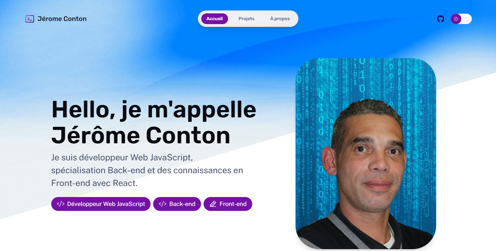

# Portfolio

> 🧑 **Portfolio** 

  

## 🧞 Lien

Voici le lien vers le portfolio correspondant à l'image ci-dessus : [portfolio de Jérôme Conton](https://jeromeconton.github.io/) (à modifier lors de la mise en ligne)

## 👀 Want to learn more?

CV de Jérôme Conton : [ contonjerome.fr](https://contonjerome.fr/)

Porfolio-Jeu à explorer [Portfolio-Jeu](https://jeromeconton.github.io/)

Site de l'application My Partner Outdoor : [ My Partner Outdoor](https://mypartneroutdoor.fr)

Site de la boulangerie La Fab'rik & Co : [ La Fab'rik & Co](https://boulangerie-lafabrik.fr/)